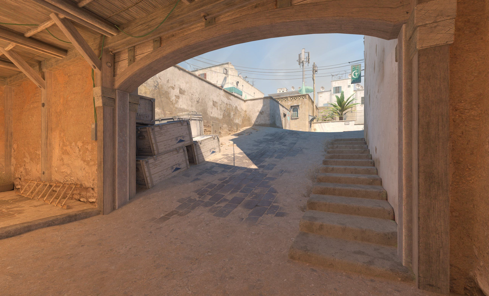

# CS2 Flash Efficiency Analysis

Analyzing flashbang efficiency in CS2 demo files using Python.

## What it does

Parses a CS2 `.dem` file and computes, for every flash thrown in the match:
- Did it blind an enemy, a teammate, or the thrower themselves?
- How many flashes each player threw, and how many were wasted

## Why

I have 3000+ hours in CS2 and always loved to analyze my demos. I made this 
project to learn more about python and pandas by building something I actually care about

## Key findings (single match)

- 59 flashes detonated; 9 of them blinded nobody at all
- Per-player waste rates ranged from ~18% to 80%
- One flash can blind multiple players, so raw event counts overstate flash count
  until you group by grenade

## Built with

- [demoparser2](https://github.com/LaihoE/demoparser) — CS2 demo parsing
- pandas — data manipulation
- Jupyter — exploratory workflow

## Status

Work in progress. Current "effective flash" rule is simple (blinded ≥1 enemy).
Next steps: factor in blind duration and whether a teammate converted the flash
into a kill.